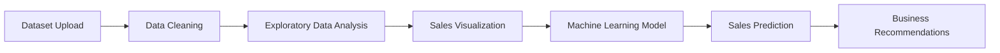

#  AI Retail Sales Bot

<p align="center">
  
  
  
</p>

---

#  Project Overview

The **AI Retail Sales Bot** is an intelligent retail sales analysis and forecasting system developed using Python in Google Colab.  

This project automates:

- Data cleaning
- Sales analysis
- Product performance tracking
- Regional analysis
- Sales trend visualization
- Machine Learning-based sales prediction
- Business recommendation generation

The bot helps businesses make data-driven decisions by transforming raw retail sales data into meaningful insights and predictive analytics.

---

#  Project Objectives

- Clean and preprocess retail sales data  
- Analyze product and regional sales performance  
- Generate interactive sales insights  
- Visualize trends using charts and graphs  
- Predict future sales using Machine Learning  
- Provide automated business recommendations  

---

#  Technologies Used

| Technology | Purpose |
|---|---|
| Python | Data Analysis & ML |
| Pandas | Data Processing |
| Matplotlib | Data Visualization |
| Scikit-learn | Machine Learning |
| Google Colab | Development Environment |
| Excel / CSV | Dataset Source |

---

# Dataset Features

The dataset contains:

- Invoice Date
- Product
- Region
- Units Sold
- Price per Unit
- Total Sales

---

#  Data Cleaning Process

The bot performs:

- Column standardization
- Date conversion and formatting
- Missing value handling
- Duplicate removal
- Invalid sales filtering

---

# 📊 Features & Functionalities

- Product Code Generator  
- Sales Trend Analysis  
- Region-wise Sales Analysis  
- Monthly Sales Tracking  
- Product Performance Dashboard  
- Dynamic User Input System  
- Automated Business Recommendations  
- Machine Learning Sales Prediction  

---

#  Exploratory Data Analysis (EDA)

The project analyzes:

- Top-selling products
- Best-performing regions
- Monthly sales trends
- Seasonal sales behavior
- Revenue estimation

---

#  Machine Learning Implementation

Implemented **Linear Regression** using Scikit-learn to predict future sales based on:

- Units Sold
- Price per Unit
- Month

### ML Workflow

```python
model = LinearRegression()
model.fit(X_train, y_train)
prediction = model.predict([[units_sold, avg_price, selected_month]])
```

---

# Visualizations

The bot generates:

- Top Products Bar Chart  
- Monthly Sales Trend Graph  
- Product-wise Sales Visualization  

---

#  Business Recommendations

The system automatically provides recommendations such as:

- High-demand regions
- Weak-performing regions
- Best sales months
- Promotion suggestions
- Seasonal marketing focus

---

#  Project Workflow



---

#  Project Structure

```bash
AI-Retail-Sales-Bot/
│
├── Dataset/
├── AI_Retail_Sales_Bot.ipynb
├── Charts/
├── README.md
└── requirements.txt
```

---

#  Sample Insights

- Identified top-performing products  
- Detected seasonal sales patterns  
- Predicted expected sales revenue  
- Analyzed region-wise business performance  
- Generated automated business suggestions  

---

#  Future Improvements

- Add Deep Learning models
- Deploy as a web application
- Integrate Power BI dashboards
- Add real-time sales prediction
- Connect with cloud databases
- Available for all kind data set like csv and excel both file
- and available for every kinda business/sales analyse bot 

---

#  Author

## Muhammed Nishad PM
- Aspiring Data Analyst & ML Enthusiast  
- Power BI | Python | SQL | Machine Learning  


---
